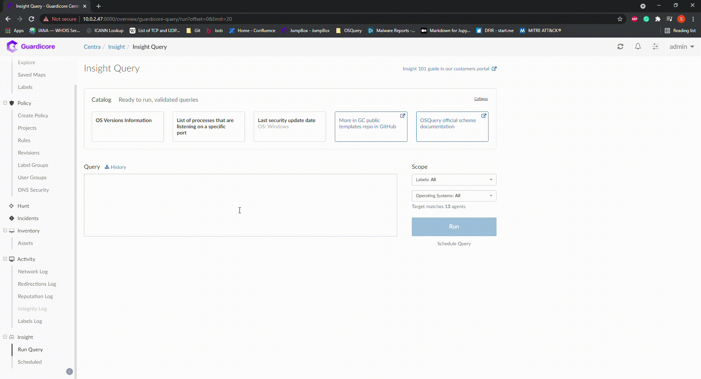

  

# Guardicore Insight
Guardicore Insight is Guardicore's integration with OSQuery, to allow our users to have greater visibility into their machines, from a single place that is Centra's UI.
We also want to provide our users immediate value with this integration, and have therefore created this repository, with multiple ready-to-use queries that you can run immediatly.

## OSQuery

  

OSQuery is a sleek, intuitive, and powerful front-end framework for faster and easier operating system instrumentation for Windows, OS X (macOS), Linux, and FreeBSD. 
OSQuery exposes an operating system as a high-performance relational database. This allows you to write SQL queries to explore operating system data. 
With osquery, SQL tables represent abstract concepts such as running processes, loaded kernel modules, open network connections, browser plugins, hardware events or file hashes.

